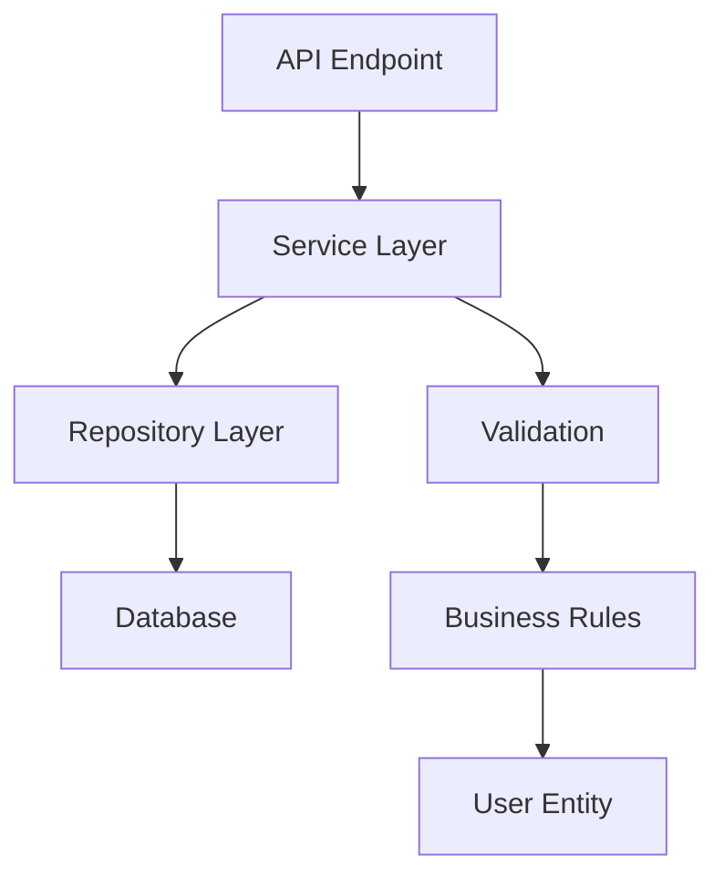

# Clean Architecture in Notes App

## Overview

The Notes App follows Clean Architecture principles, ensuring a clear separation of concerns and maintainable codebase. This document explains how Clean Architecture is implemented in our application.

## Clean Architecture Layers

### 1. Entities (Models)
**Location**: `src/models/`
**Purpose**: Core business entities that represent the fundamental concepts of our domain.

```python
# Example: User entity
class User(Base):
    __tablename__ = "users"

    id = Column(Integer, primary_key=True)
    email = Column(String(255), unique=True, nullable=False)
    # ... other fields
```

**Characteristics**:
- Contains only data and basic business rules
- Independent of any external concerns
- No dependencies on frameworks or databases
- Represents the core business concepts

### 2. Use Cases (Services)
**Location**: `src/services/`
**Purpose**: Application-specific business rules and orchestration.

```python
# Example: Authentication service
class AuthenticationService:
    def register_user(self, user_data: UserCreate) -> User:
        # Business logic for user registration
        pass
```

**Characteristics**:
- Contains application-specific business rules
- Orchestrates data flow between entities and repositories
- Independent of UI and database
- Defines the application's use cases

### 3. Interface Adapters (Repositories & Schemas)
**Location**: `src/repositories/` and `src/schemas/`
**Purpose**: Convert data between use cases and external systems.

```python
# Example: User repository
class UserRepository:
    def create(self, user_data: dict) -> User:
        # Data access implementation
        pass
```

**Characteristics**:
- Convert data between use cases and external systems
- Implement interfaces defined by use cases
- Handle data transformation and validation
- Abstract external dependencies

### 4. Frameworks & Drivers (API & Database)
**Location**: `src/api/` and database configuration
**Purpose**: External interfaces and infrastructure.

```python
# Example: FastAPI router
@router.post("/register", response_model=UserResponse)
async def register_user(user_data: UserCreate):
    # API endpoint implementation
    pass
```

**Characteristics**- Contains external interfaces (API, database)
- Handles HTTP requests and responses
- Manages database connections
- Implements framework-specific code

## Dependency Rule

The most important rule in Clean Architecture is the **Dependency Rule**:

> Dependencies can only point inward. Nothing in an inner circle can know anything at all about something in an outer circle.

### Dependency Flow

```
API Layer (Outer) → Service Layer → Repository Layer → Models (Inner)
```

### Implementation in Notes App

1. **API Layer** depends on **Service Layer**
2. **Service Layer** depends on **Repository Layer**
3. **Repository Layer** depends on **Models**
4. **Models** have no dependencies

## Benefits of Clean Architecture

### 1. Independence
- **Framework Independence**: Can swap FastAPI for another framework
- **Database Independence**: Can change from PostgreSQL to another database
- **UI Independence**: Can add mobile app or web frontend

### 2. Testability
- **Unit Testing**: Each layer can be tested independently
- **Mocking**: Easy to mock dependencies for testing
- **Isolation**: Business logic is isolated from external concerns

### 3. Maintainability
- **Clear Separation**: Each layer has a clear responsibility
- **Easy Changes**: Changes in one layer don't affect others
- **Code Organization**: Easy to find and modify specific functionality

## Layer Responsibilities

### Models Layer
- Define business entities
- Contain basic business rules
- Represent data structures
- No external dependencies

### Services Layer
- Implement business logic
- Orchestrate use cases
- Coordinate between repositories
- Handle business rules

### Repository Layer
- Abstract data access
- Implement data persistence
- Handle database operations
- Provide data to services

### API Layer
- Handle HTTP requests
- Validate input data
- Transform responses
- Manage authentication

## Example: User Registration Flow



### Step-by-Step Process

1. **API Layer**: Receives HTTP request with user data
2. **Service Layer**: Validates data and applies business rules
3. **Repository Layer**: Persists user data to database
4. **Database**: Stores the user information
5. **Response**: Returns success/failure response

## Best Practices

### 1. Dependency Injection
```python
class AuthenticationService:
    def __init__(self, db: Session):
        self.db = db
        self.user_repository = UserRepository(db)
```

### 2. Interface Segregation
```python
class UserRepositoryInterface:
    def create(self, user_data: dict) -> User:
        pass

    def get_by_id(self, user_id: int) -> Optional[User]:
        pass
```

### 3. Single Responsibility
Each class has one reason to change:
- **UserRepository**: Only handles user data access
- **AuthenticationService**: Only handles authentication logic
- **UserRouter**: Only handles HTTP requests for users

## Testing Strategy

### Unit Tests
- Test each layer independently
- Mock external dependencies
- Focus on business logic

### Integration Tests
- Test layer interactions
- Use real database for repository tests
- Test service layer with real repositories

### API Tests
- Test complete request/response cycle
- Test authentication and authorization
- Test error handling

## Common Pitfalls

### 1. Violating Dependency Rule
❌ **Wrong**: Service layer importing API models
```python
# Don't do this
from src.api.schemas import UserResponse
```

✅ **Correct**: API layer importing service models
```python
# Do this
from src.services.authentication import AuthenticationService
```

### 2. Business Logic in API Layer
❌ **Wrong**: Business logic in router
```python
@router.post("/register")
async def register_user(user_data: UserCreate):
    # Business logic here - WRONG
    if not user_data.email:
        raise HTTPException(400, "Email required")
```

✅ **Correct**: Business logic in service
```python
@router.post("/register")
async def register_user(user_data: UserCreate, auth_service: AuthenticationService):
    return auth_service.register_user(user_data)
```

### 3. Direct Database Access in Services
❌ **Wrong**: Direct database queries in service
```python
class AuthenticationService:
    def get_user(self, user_id: int):
        return self.db.query(User).filter(User.id == user_id).first()
```

✅ **Correct**: Use repository pattern
```python
class AuthenticationService:
    def get_user(self, user_id: int):
        return self.user_repository.get_by_id(user_id)
```

## Conclusion

Clean Architecture in the Notes App provides:

- **Maintainable Code**: Clear separation of concerns
- **Testable Components**: Easy to test each layer
- **Flexible Design**: Easy to change external dependencies
- **Scalable Structure**: Easy to add new features
- **Quality Assurance**: Enforces good coding practices

By following Clean Architecture principles, the Notes App maintains high code quality, testability, and maintainability while providing a solid foundation for future development.
